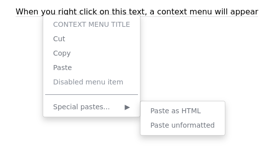

# Context menu for Angular

  

A context menu component for Angular.

Documentation and demos https://perfectmemory.github.io/ngx-contextmenu/

## Features

- [x] Context menu triggered by right click or keyboard context menu key
- [x] Sub menus
- [x] Dividers
- [x] Form (example checkboxes)
- [x] Keyboard navigation
- [x] Support direction `ltr` (left to right) and `rtl` (right to left)
